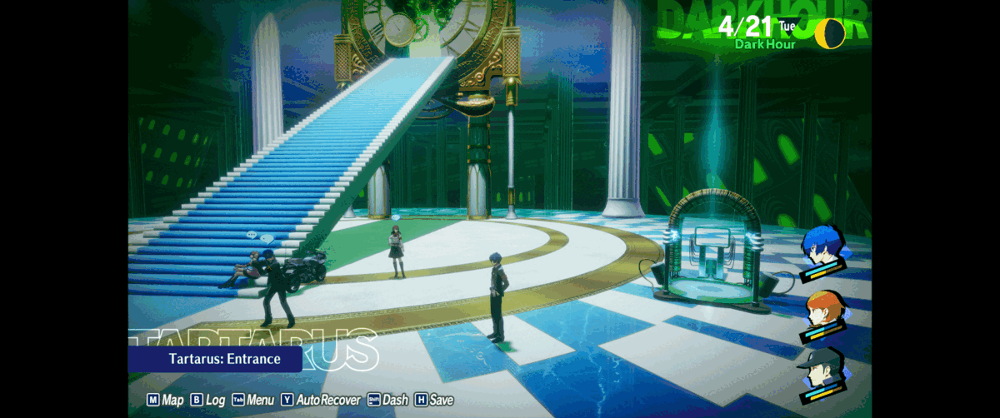

# Persona 3 Reload Fix

P3RFix adds custom resolutions, ultrawide support and other quality-of-life options to Persona 3 Reload on PC.

- Correct aspect ratio, field of view and HUD placement for ultrawide and narrower displays.
- Skip startup screens and uncap 60 FPS menus.
- Adjust render scale and the resolution of character previews in menus.
- Choose whether the game pauses when you switch windows.
- Optional developer console, frame-rate cap and mouse camera adjustments.

Maintained by [dev-camo](https://github.com/dev-camo) and contributors, continuing the original work by Lyall.



## Install

1. Download `P3RFix_<version>.zip` from the [latest release](https://github.com/dev-camo/P3RFix/releases/latest).
2. Extract it into the folder containing `P3R.exe`:
   - **Steam:** `steamapps\common\P3R\P3R\Binaries\Win64`
   - **Xbox / Microsoft Store:** `XboxGames\Persona 3 Reload\Content\P3R\Binaries\WinGDK`
3. Check that `P3RFix.asi`, `P3RFix.ini` and `dsound.dll` are alongside `P3R.exe`, then launch the game normally.

On **Steam Deck or Linux**, also add this to the game's Steam launch options:

```text
WINEDLLOVERRIDES="dsound=n,b" %command%
```

For **Reloaded-II**, use `P3RFix_Reloaded-II.zip` and follow the [installation guide](docs/installation.md#reloaded-ii). The guide also covers updates and removal.

## Configure

Close the game, open the installed `P3RFix.ini` in a text editor, change the settings you want, and save it before launching again. The file includes comments explaining each option.

With a standalone installation, the configuration is beside `P3R.exe`. With Reloaded-II, it is in the installed P3RFix mod folder. See the [configuration guide](docs/configuration.md) for more detail.

## Help and known issues

- Some fades and transitions do not fill the screen at non-16:9 resolutions.
- Skipping directly to **Load Save** can softlock the game if you back out; use the main menu instead.
- Disabling pause on focus loss can affect mouse capture; enter a menu before switching windows.

See [troubleshooting](docs/troubleshooting.md) if the fix does not load or a setting causes problems. To [report an issue](https://github.com/dev-camo/P3RFix/issues), include your P3RFix version, steps to reproduce it and `P3RFix.log` from the folder containing `P3R.exe`.

## More information

- [Changelog](.github/release/CHANGELOG.md)
- [License and credits](docs/credits.md)
- [Maintainer documentation](.github/maintainers/README.md)

P3RFix is distributed under the [MIT License](LICENSE.md). Release ZIPs include a `LICENSES` document containing the project license and third-party notices.
